# Alexandrov Puzzle - Latin Cross Folding Visualization

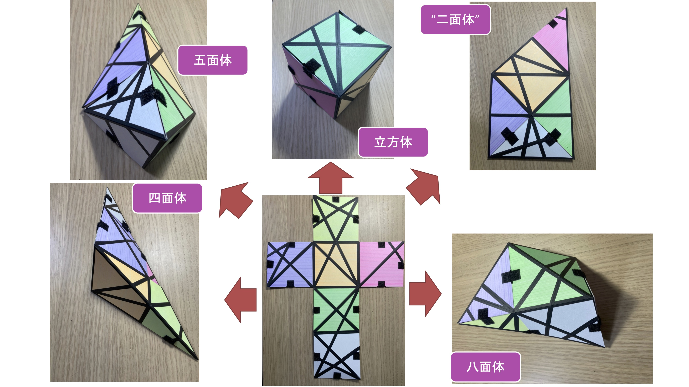

A Python implementation for exploring the Alexandrov theorem through Latin cross folding patterns. This program enumerates all valid "chuck folding" sequences for a Latin cross and visualizes the 2D nets.

This is a companion code for the paper:
- K. Takenaga, and S. Kaji. [Alexandrov Puzzle](https://archive.bridgesmathart.org/2022/bridges2022-371.html). *Bridges 2022: Mathematics, Art, Music, Architecture, Culture*, pp. 371-374.

## Background

This program explores how a Latin cross (the classic net of a cube) can be folded into various convex polyhedra using "chuck adhesion".

A **Latin cross** is a 14-vertex polygon that can be folded into:
- Cube (C)
- Tetrahedron (T)
- Double-covered pentagon (Q)
- Pentahedron (P)
- Octahedron (O)

## Features

- **Chuck folding enumeration**: Finds all valid folding sequences
- **Equivalence classification**: Groups symmetric patterns (9 unique patterns from the Latin cross)
- **2D net visualization**: Displays the Latin cross with fold lines and glued vertices

## Requirements

```bash
pip install numpy matplotlib
```

## Usage

```bash
python alexandrov.py
```
The program creates an `output/` directory containing nets of resulting polyhedra.

## Algorithm

Vertices are numbered 1-14 counterclockwise.
```
        1---14
        |    |
   12---13   2---3
   |            |
   11---10   5---4
        |    |
        9    6
        |    |
        8----7
```

1. **Chuck folding**: At each step, select a vertex where the sum of adjacent angles is < 360°
2. **Vertex identification**: When folding, identify (glue) the two adjacent vertices
3. **Recursion**: Continue until only 2 vertices remain
4. **Classification**: Group results by equivalence (including left-right symmetry)

## Folding Patterns

### Doubly Covered Pentagon (Q)
| Q0 | Q1 |
|:--:|:--:|
| 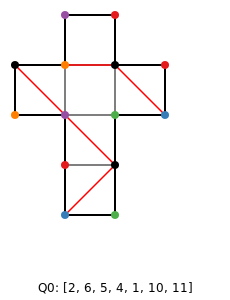 | 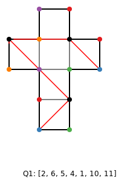 |

### Tetrahedron (T)
| T0 | T1 |
|:--:|:--:|
| 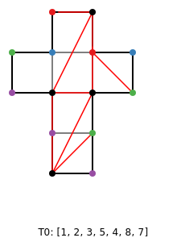 |  |

### Pentahedron (P)
| P0 | P1 |
|:--:|:--:|
| 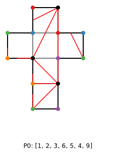 | 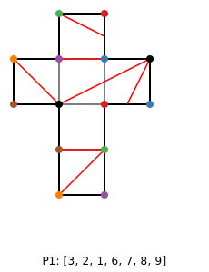 |

### Octahedron (O)
| O0 | O1 |
|:--:|:--:|
| 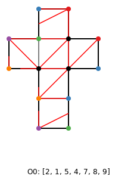 | 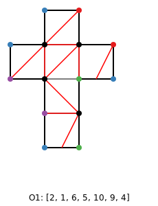 |

### Cube (C)
| C0 |
|:--:|
| 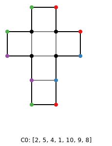 |


## 3D printed Models

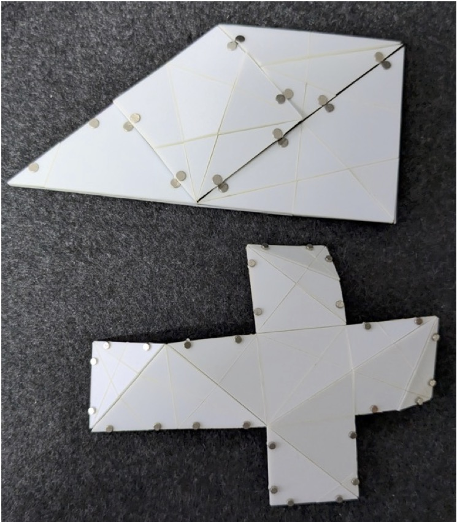
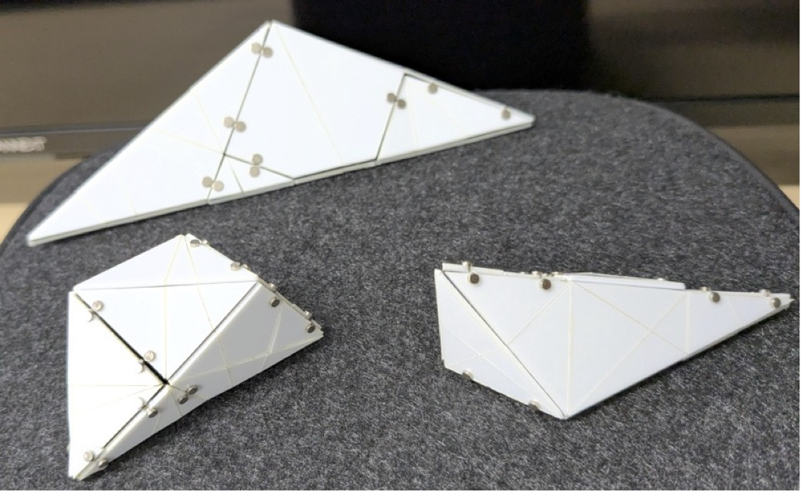


## References

- K. Takenaga, and S. Kaji. [Alexandrov Puzzle](https://archive.bridgesmathart.org/2022/bridges2022-371.html). *Bridges 2022: Mathematics, Art, Music, Architecture, Culture*, pp. 371-374.
- A. D. Alexandrov. Convex Polyhedra. Springer Monographs in Mathematics, Springer, 2005.
- E. D. Demaine, M. L. Demaine, A. Lubiw, J. O'Rourke, and I. Pashchenko. "Metamorphosis of the Cube." Proceedings of the 15th Annual ACM Symposium on Computational Geometry (SoCG'99), 409–410, 1999.
- E. D. Demaine and J. O'Rourke. Geometric Folding Algorithms: Linkages, Origami, Polyhedra. Cambridge University Press, USA, 2008.
- D. Kane, G. N. Price, and E. D. Demaine. "A pseudopolynomial algorithm for Alexandrov's Theorem." Proceedings of the 11th Algorithms and Data Structures Symposium (WADS 2009), Lecture Notes in Computer Science, 5664, 435–446, 2009.
- A. Lubiw and J. O'Rourke. "When Can a Polygon Fold to a Polytope?" Proceedings AMS Conference, Lawrenceville, NJ, 1996.
